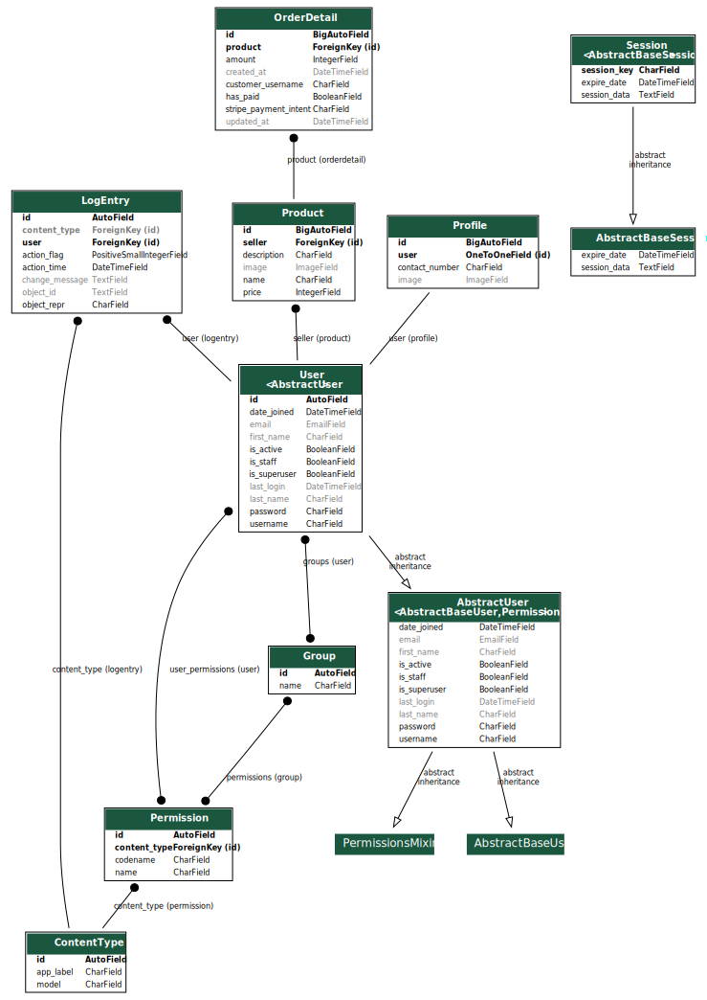

# OnlineStoreHub

OnlineStoreHub is an intuitive electronic marketplace where users can effortlessly sell and buy a wide variety of products online. Sellers can create listings with detailed information, including product names, descriptions, and prices. Buyers can securely make purchases using the Stripe payment technology, ensuring a seamless shopping experience.

## Technologies and Tools Used

| Technology/Tool | Description |
| --------------- | ----------- |
| **Python**      | Programming language used for backend development. |
| **Django**      | High-level Python web framework that encourages rapid development and clean, pragmatic design. |
| **SQLite**      | Lightweight, serverless, self-contained SQL database engine used for efficient data management. |
| **Node.js**     | JavaScript runtime for building scalable network applications. |
| **Tailwind CSS**| Highly customizable, low-level CSS framework that brings utility-first styling to web development. |
| **Stripe**      | Secure online payment processing for internet businesses. |
| **HTML/CSS/JavaScript** | Frontend technologies for building responsive and interactive user interfaces. |

## Features

### For Sellers:
- **Product Listings**: Sellers can create detailed product listings, including product names, descriptions, prices, and images.
- **Easy Management**: Sellers can manage their listings, update product information, and mark items as sold.
- **Secure Transactions**: Sellers receive payments through Stripe, ensuring secure and reliable transactions.
- **Profile Customization**: Sellers can personalize their profiles with images and contact information.

### For Buyers:
- **Browsing**: Buyers can browse through a wide range of products and view detailed information about each item.
- **Secure Payments**: Buyers can make payments securely using Stripe, with options for various payment methods.
- **Order Tracking**: Buyers can track their orders, view payment status, and receive notifications about order updates.

## Setting Up Virtual Environment
To create a virtual environment for the project, use the following command:
```bash
python -m venv venv
```

## Activating Virtual Environment
Activate the virtual environment using the appropriate command based on your operating system:

- **On Windows:**
```bash
venv\Scripts\activate
```

- **On macOS and Linux:**
```bash
source venv/bin/activate
```

Before running the project, navigate to the project directory using the following command:
```bash
cd .\mysite\
```

## Installing Dependencies
Ensure all the required libraries are installed by running the following command:
```bash
pip install -r requirements.txt
```

## Running the Project

### Using runserver
You can run the project locally using the Django development server. Execute the following command:
```bash
python manage.py runserver 127.0.0.1:8080
```

The application will be accessible at `http://127.0.0.1:8080/`.

### Using Docker
To run the project using Docker, make sure you have Docker installed on your system. Then, build the Docker image and run the container with the following commands:
```bash
docker build -t onlinestorehub .
docker run -p 8000:8000 onlinestorehub
```

The application will be accessible at `http://0.0.0.0:8000/` inside the Docker container.

## Database Structure
The project uses SQLite database with the following models:

1. **Product**
   - Fields: seller, name, price, description, image

2. **OrderDetail**
   - Fields: customer_username, product, amount, stripe_payment_intent, has_paid, created_at, updated_at

3. **Profile**
   - Fields: user, image, contact_number

## Additional Configurations
- Test Stripe API keys are provided in `settings.py`.
- Admin credentials (username and password) are available in the `admin.txt` file.

## Project Diagram

